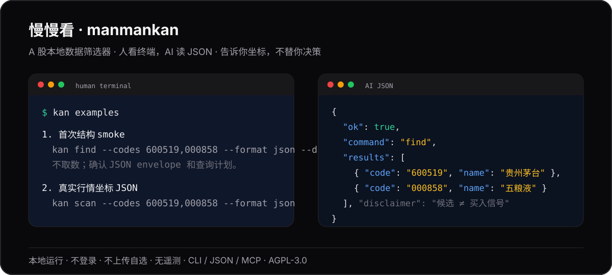

# 慢慢看 · manmankan

> **先看清，再决定。A股行情翻译官。**
>
> 散户看得清，AI 调得动。只给数据，不给答案。

[](https://www.gnu.org/licenses/agpl-3.0)
[](https://www.python.org/downloads/)
[](https://pypi.org/project/manmankan/)
[](https://pypi.org/project/manmankan/)
[](https://github.com/piklen/manmankan/actions/workflows/test.yml)
[](docs/compliance.md)
[](docs/find.md)
[](skills/manmankan-skill.md)



慢慢看是一个纯命令行工具。它把一批 A 股候选整理成"坐标清单"：多周期位置、共振、估值/资金/技术字段、命中规则和缺数据状态。人可以在终端里快速扫一眼，AI 可以直接消费低噪声 JSON 继续做解释、排序、研究清单或交叉验证。

```bash
uv tool install manmankan
kan --version
kan guide
kan find --codes 600519,000858 --format json --dry-run
kan find --codes 600519,000858 --format json --fields @core,@valuation,@moneyflow,@technical
kan scan --codes 600519,000858 --periods 5,20,60,180 --format json
kan mcp install --dry-run --format json
kan mcp http --host localhost --port 8765
kan hold cash 50000
kan hold add 600519 --cost 1680 --shares 100
kan hold --format json --mask
```

`kan find --codes ... --format json --dry-run` 是不取数的结构 smoke；去掉 `--dry-run` 后，`kan find --codes ... --fields ... --format json` 会按显式字段补估值、资金、技术等客观数据，不需要伪造永真 filter。`kan scan --codes ... --format json` 会拉公开日 K 并输出真实位置坐标，首次运行可能需要几十秒建立本地缓存。

如果你也想先把候选池数据说清楚，再交给人或 AI 慢慢研究，可以 star 关注后续版本。

## 三类人从这里开始

| 你是谁 | 先跑 / 先读 |
|---|---|
| 中国用户 / 开发者 | [`docs/china-quickstart.md`](docs/china-quickstart.md)：PyPI 镜像、行情源网络、TuShare、代理和 Windows / PowerShell |
| AI agent / 自动化脚本 | `kan find --codes 600519,000858 --format json --dry-run` + [`docs/ai-quickstart.md`](docs/ai-quickstart.md) + [`skills/manmankan-skill.md`](skills/manmankan-skill.md) |
| 第一次贡献者 | [`docs/contributor-quickstart.md`](docs/contributor-quickstart.md)：本地跑起来、验证命令、good first issue、合规边界 |

<details>
<summary><b>English summary</b></summary>

**manmankan** (*"take your time, see clearly"*) is an A-share data translation layer — it turns raw market data into structured, auditable CLI/JSON outputs for both retail investors and AI workflows. Watchlists, industries, themes, hot lists, full-market scans, or external code pools — one command, one clean output.

Data, not decisions: no buy/sell advice, no ratings, no price targets. Python 3.11+ · local-first · A-share (architecture designed for multi-market extension) · [GNU AGPL-3.0](LICENSE).
</details>

## 为什么存在

很多选股流程的问题不在于缺少观点，而在于输入太散：自选股、行业成分、题材池、热榜、全市场截面、外部候选代码各有入口；行情位置、估值裸值、资金、技术指标、缺数据状态又分散在不同地方。

慢慢看把这些输入统一成一个可复核的数据层：

- **给人看**：在终端里快速看到候选池的多周期位置、共振、涨跌、行业 / 题材 / 热榜背景。
- **给 AI 用**：用低噪声 JSON 把候选、字段、命中条件、缺数据语义交给模型，方便继续做解释、排序、研究清单或交叉验证。
- **给自动化用**：CLI 和 `kan.api` 都能接外部代码池，适合 cron、notebook、脚本和本地研究流水线。
- **给持仓看坐标**：用户手动录入成本、股数和现金后，`kan hold` 计算今日 / 累计盈亏、仓位和 30 / 60 / 180 日位置。

如果你要让 AI 参与候选筛选，慢慢看的角色是提供可审计输入：它负责把"坐标"和"条件命中"说清楚，不负责替你下结论。

## 为 AI 设计

慢慢看从第一天起就把 AI Agent 当作一等用户。与传统的"先做人类终端、再挂 JSON 输出"不同，manmankan 的每个命令都同时考虑人类可读和机器可消费两种输出形态。

| 设计决策 | 说明 |
|----------|------|
| **JSON 是产品，不是后门** | `--format json` 输出包含 `ok`、`schema_version`、`query_time`、`data_availability`、`disclaimer`、`error` 信封——AI 不需要猜测字段含义或处理裸异常 |
| **低上下文成本** | `--compact` / `--fields @core` / `--agent-summary` / `--no-compact-context` 让 AI 按需索取，不浪费 token |
| **Schema 自发现** | `kan schema --format json` 返回 CLI JSON、find DSL、MCP tools 和错误 envelope 的机器可读契约；`--section find --compact` 可低上下文只取筛选契约 |
| **查询计划和 delta** | `kan find --dry-run` 预演数据源与高成本维度；`--snapshot` / `--since` 支持显式本地会话 delta |
| **示例可机器读取** | `kan examples --format json` 输出端到端命令清单，AI 可以先读示例再选择最短命令 |
| **Skills.md 能力清单** | [`skills/manmankan-skill.md`](skills/manmankan-skill.md) 是给 AI Agent 的"说明书"——AI 读到它就知道 manmankan 能做什么、怎么调、错误怎么处理 |
| **MCP Server** | `kan mcp serve` 提供 stdio MCP；`kan mcp http` 提供本机 Streamable HTTP endpoint；tools/list 暴露 `outputSchema`，tools/call 同时返回 text 与 `structuredContent`；接入细节见 [`docs/mcp.md`](docs/mcp.md) |
| **退出码即 API** | 每个命令的退出码有明确语义（0=成功，非 0=具体错误类别），AI 不需要解析 stderr 来判断成败 |

AI agent 首次接入推荐读 [`docs/ai-quickstart.md`](docs/ai-quickstart.md)。它把“查询计划 smoke”和“真实取数路径”拆开，避免把预演当成已经形成行情证据。

中国用户 / 开发者如果遇到 PyPI 下载慢、行情源网络、TuShare token、Windows PowerShell 或代理问题，先看 [`docs/china-quickstart.md`](docs/china-quickstart.md)。

## 快速开始

```bash
uv tool install manmankan
kan add 600519 601318 000858
kan scan
```

第一次 `kan scan` 会拉取日 K 线并建立本地缓存，之后按天增量更新。忘了命令直接跑：

```bash
kan help
kan guide
kan daily
kan setup --dry-run
kan scan --help
kan find --help
```

常用入口：

```bash
kan scan                                      # 扫默认池（自选 ∪ 持仓）
kan scan --only-watchlist                     # 只扫自选
kan scan --exclude-star --exclude-bj          # 排除科创板 / 北交所
kan scan --codes 600519,000858               # 扫外部候选代码池
kan scan --periods 5,20,60,180 --wide         # 自定义 2-360 周期并全量展示
kan info 600519                               # 单股详情 + 所属行业位置均值/排名对照
kan find --codes 600519,000858 --format json --dry-run # 不取数的查询计划 smoke
kan find --codes 600519,688981 --format json --fields @core,@retail
kan find --codes 600519,688981 --format json --fields @core,@valuation,@moneyflow,@technical
kan scan --codes 600519,000858 --format json # 拉公开日 K 的真实坐标 JSON
kan find --all --pe lt:20 --format json --compact
kan hold cash 50000                           # 录入现金,用于展示一手占现金比例
kan hold add 600519 --cost 1680 --shares 100 # 手动录入真实持仓事实
kan hold                                      # 持仓盈亏 + 仓位 + 位置总览
kan hold --format json --mask                 # AI/脚本消费；金额脱敏
kan board rank --kind industry --by moneyflow --format json
kan history 600519 --format json
```

`kan scan` 面向终端阅读；`kan find --format json` 和 `kan hold --format json` 面向脚本和 AI 消费。

## 数据契约

慢慢看的核心输出不是"推荐"，而是可组合的数据事实。

主要能力：

- 多周期位置百分位：3 / 5 / 7 / 10 / 15 / 30 / 60 / 90 / 120 / 180 日。
- 共振：同一候选在多个周期同时接近低位或高位。
- 散户事实：一手金额、占已录入现金比例、科创/北交/创业板权限提示、距区间高低点距离、量价方向组合。
- 候选池：自选、行业、题材、热榜、全市场、外部 `--codes` 或 stdin。
- 真实持仓：用户 CLI 录入成本 / 股数 / 现金，本地计算市值、仓位、今日和累计盈亏。
- 筛选条件：位置、共振、涨跌、连阳连阴、估值、质量、资金、技术指标、筹码、股东、除权除息事件等。
- 输出形态：终端表格、Markdown、JSON、紧凑 JSON、字段白名单、Python API。

JSON 相关入口：

```bash
kan schema --format json --section find --compact
kan find --industry 半导体 --format json --fields @core,@valuation
kan find --codes - --format json --compact
kan find --codes 600519,000858 --format json --agent-summary
kan find --codes 600519,000858 --format json --snapshot
kan find --all --format json --compact --no-compact-context
```

机器可读 schema 先看 `kan schema --format json`；完整 `kan find` 字段分组、`data_availability`、缺数据语义、错误 envelope 见 [`docs/find.md`](docs/find.md)。脚本化入口以 [`kan/api.py`](kan/api.py) 文件头 docstring 为公开 contract。

## 安装

要求 Python 3.11+。推荐用 [uv](https://docs.astral.sh/uv/)：

```bash
uv tool install manmankan
kan --version
```

其他方式：

```bash
pipx install manmankan
python3 -m venv ~/.kan-venv && source ~/.kan-venv/bin/activate && pip install manmankan
git clone https://github.com/piklen/manmankan.git && cd manmankan && uv sync && uv run kan --version
```

如果装完当前终端找不到 `kan`，打开新终端让 PATH 生效。国内镜像源同步慢时，可以临时直连 PyPI：

```bash
uv tool install manmankan --index-url https://pypi.org/simple/
```

## 市场覆盖

**当前专注 A 股。** 数据源适配层为多市场扩展设计——美股、港股、加密货币等市场可以作为独立 Source 接入，共享同一套 CLI 命令语义和 JSON schema。详见 [`docs/architecture.md`](docs/architecture.md)。

## 边界

慢慢看不会做这些事：

- 不推荐具体股票。
- 不预测涨跌。
- 不给买卖建议、评级、目标价或仓位建议。
- 不内置策略 preset、打分模型或"最佳标的"排序。
- 不下单、不接券商账户、不自动读取外部持仓；真实持仓只来自用户在 CLI 录入的本地 XDG 数据。
- 不提供实时行情推送、分钟级行情、港股、美股、期货或完整财报数据库（多市场是远期路线图，当前仅 A 股）。
- 不内置 AI / LLM / 托管服务——AI 由用户自己选择和运行。

位置百分位的定义是：

```text
(当前价 - N 日最低价) / (N 日最高价 - N 日最低价) * 100
```

`0%` 表示 N 日区间最低，`100%` 表示 N 日区间最高。共振 `×N` 表示多个周期同时接近低位或高位。它们只是坐标，不是信号。合规细则见 [`docs/compliance.md`](docs/compliance.md)。

## 隐私与数据

慢慢看本地运行：

- 自选股、缓存、扫描快照存放在 `~/.local/share/kan/`，按 XDG 规范管理。
- 真实持仓存放在 `~/.local/share/kan/positions.json`，父目录 `0700`，文件 `0600`。
- 持仓输出可加 `--mask` 脱敏金额；本地数据仍可能被 Time Machine / iCloud 等系统备份工具复制。
- 不需要登录，不上传自选股，不做遥测。
- CLI 会访问公开行情数据源；更新检查会访问 PyPI，可用 `KAN_NO_UPDATE_CHECK=1` 关闭。
- 配置 TuShare token 后，token 只发往你配置的 TuShare API 端点。
- `kan uninstall` 会清理本地数据并提示对应的软件包卸载命令。

本项目代码和文档使用 [GNU AGPL-3.0](LICENSE)（`AGPL-3.0-only`）。如果你修改本项目并通过网络服务提供交互，需要按 AGPL 向用户提供对应源代码。市场数据主要来自 AKShare 生态及公开行情源，可用性依赖上游；第三方行情数据、API、SDK 和 TuShare Pro 权限不由本项目授权，使用时仍需遵守对应上游条款、额度和合规要求。

## 文档导航

| 文档 | 用途 |
|---|---|
| [`CHANGELOG.md`](CHANGELOG.md) | 版本变更记录 |
| [`docs/architecture.md`](docs/architecture.md) | 架构愿景：三层定位、Source 模型、多市场路线、AI 消费设计 |
| [`docs/china-quickstart.md`](docs/china-quickstart.md) | 中国用户 / 开发者首用路径、国内网络、PyPI 镜像、TuShare 与代理排查 |
| [`docs/contributor-quickstart.md`](docs/contributor-quickstart.md) | 首次贡献路径、good first issue、验证命令和 AI 协作边界 |
| [`docs/ai-quickstart.md`](docs/ai-quickstart.md) | AI agent 首用路径、JSON / MCP 消费规则 |
| [`docs/mcp.md`](docs/mcp.md) | MCP 支持客户端、dry-run、写入规则和 agent 解释边界 |
| [`docs/find.md`](docs/find.md) | `kan find` JSON schema、字段、缺数据语义 |
| [`docs/compliance.md`](docs/compliance.md) | 合规边界、公开输出语言规范 |
| [`docs/roadmap.md`](docs/roadmap.md) | 路线图和明确不做的方向 |
| [`skills/manmankan-skill.md`](skills/manmankan-skill.md) | AI Agent 能力清单（给 AI 读的说明书） |
| [`AGENTS.md`](AGENTS.md) | AI 编程助手进入本仓库时的开发边界和验证命令 |
| [`SUPPORT.md`](SUPPORT.md) | 支持范围、Discussions / Issues 分流和安全报告入口 |
| [`kan/api.py`](kan/api.py) | Python API 公开 contract |
| [`SECURITY.md`](SECURITY.md) | 安全与漏洞报告 |
| [`CONTRIBUTING.md`](CONTRIBUTING.md) | 开发、测试、贡献规范 |

## 开发

```bash
git clone https://github.com/piklen/manmankan.git
cd manmankan
uv sync
uv run ruff check kan/ tests/
uv run mypy
uv run pytest -q -m "not network and not tty"
```

启用本地 hooks：

```bash
git config core.hooksPath .githooks
```

第一次贡献先读 [`docs/contributor-quickstart.md`](docs/contributor-quickstart.md)，也可以先从 [`good first issue`](https://github.com/piklen/manmankan/issues?q=is%3Aissue%20is%3Aopen%20label%3A%22good%20first%20issue%22) 开始；贡献规范详见 [`CONTRIBUTING.md`](CONTRIBUTING.md)，尤其是公开输出的中性语言和合规边界。

## 许可证

[GNU AGPL-3.0](LICENSE) · © 2026 piklen

你可以在 `AGPL-3.0-only` 条款下使用、修改和分发本项目代码。修改版本、二次分发和网络服务使用需遵守 AGPL 的源码提供和同许可要求。项目许可证只覆盖本仓库的代码与文档，不替代第三方行情数据、API、SDK 或投资合规义务。

Bug / 功能反馈走 [GitHub Issues](https://github.com/piklen/manmankan/issues) 或 [Discussions](https://github.com/piklen/manmankan/discussions)。
贴日志前先看 [安全反馈说明](docs/china-quickstart.md#8-反馈问题时请带上这些信息)，脱敏 token、代理账号、本机路径和持仓金额。
