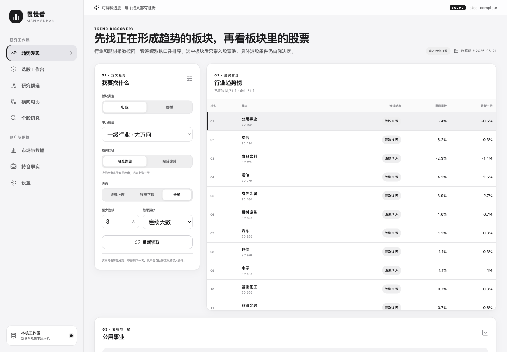

# 慢慢看 · manmankan

> **先看趋势，再定义规则，再复跑证据。A 股选股研究工作台。**
>
> 散户看得清，AI 调得动。只给数据，不给答案。

[](https://www.gnu.org/licenses/agpl-3.0)
[](https://www.python.org/downloads/)
[](https://pypi.org/project/manmankan/)
[](https://pypi.org/project/manmankan/)
[](https://github.com/piklen/manmankan/actions/workflows/test.yml)
[](docs/compliance.md)
[](docs/china-quickstart.md)



慢慢看是一个给普通 A 股用户使用的本地优先趋势选股研究工作台。它把“行业/题材趋势发现、成分股下钻、客观阈值、运行结果、候选研究和横向对比”连成一条可复跑流水线，重点回答四个问题：**哪里正在形成趋势、板块里哪些股票符合我写下的规则、为什么符合、与上次运行相比发生了什么变化**。

```bash
uv tool install manmankan
kan web
```

浏览器会打开只监听本机的 React + TypeScript 工作台。每次启动都会生成一条仅本次有效的随机会话链接；如果浏览器没有自动打开，请使用终端刚打印的完整地址。你可以直接在网页里：

- 把申万行业或概念题材指数当作 OHLC 标的，按连续涨跌、连续阳线/阴线、最新涨幅或主力净额发现趋势。
- 复核板块近日日涨跌轨迹和成分股内部结构：上涨/下跌家数、中位涨跌及涨跌靠前成员；这些事实不冒充指数权重贡献或新闻因果。
- 保存行业与题材的每日趋势复看，跨日区分连续天数延长/缩短、方向切换和数据可用性变化；相同数据重复点击不会制造历史。
- 把所选板块一键带入 Screen；系统只带入股票池，不偷加选股条件。
- 从自选、持仓、全市场、行业、题材或自定义代码池建立 `Screen`。
- 组合 27 类中文条件、AND / OR、最多三层排序、结果字段和缺失值策略；全市场按数据能力开放其中 23 类。
- 保存并版本化规则，形成不可变 `ScreenRun`，查看数据截止日、覆盖率、逐条件实际值与来源。
- 重跑同一规则，查看新增、移出和排名变化；历史规则可预览并恢复为新版本。
- 把结果加入独立候选池，记录状态、来源运行和待验证问题；规则重跑不会冲掉人工研究进度。
- 保存 3–10 只股票的对比组，横向查看最近一次可追溯运行中的位置、估值、资金和技术数据。
- 在“市场与数据”页用 SQLite 持久任务更新默认池或全市场；部分失败、中断和恢复水位保持可见。
- 录入、修改或删除持仓和现金，查看盈亏与仓位事实。

所有自选、持仓、缓存和 token 都保存在本机；不登录 manmankan 服务、不做云同步或遥测。查询行情时会向所选数据源发送股票代码；配置 TuShare 时，token 只发送到你配置的数据源。持仓成本、股数和现金不会发送。

## 普通用户从这里开始

### 1. 先看板块趋势

```bash
kan web
```

默认页是“趋势发现”：先切换行业/题材、收盘连续/阳线连续、方向与天数，再复核板块近日日涨跌和同一截止日的成员涨跌分布。成员涨跌靠前不等于指数贡献；点击“用本板块选股”只会把板块成分股带入 Screen，不预置阈值、排除项或排序。

### 2. 写下规则并保存运行

可以从趋势板块下钻，也可以直接打开“选股工作台”选择股票池。再用“添加条件”组合客观阈值；新规则至少由用户添加一个条件或勾选一个排除项后才允许保存/运行。点击“保存并运行”后，规则版本和运行结果都会写入本机；同一规则、同一数据产生稳定的 `spec_hash` / `result_hash`，每次运行仍有独立 `run_id`。

### 3. 核对覆盖率与逐条件证据

结果不是一列代码：每一行都保留实际值、阈值、数据日、来源和证据引用。缺数据、陈旧数据和不支持的全市场字段不会被当成 `0`，也不会静默制造完整结果。

### 4. 每日复看已有事实与规则

“每日复看”会保存行业与题材的最新完整趋势事实；第一份只建立基线，后续同口径记录才显示连续天数和数据可用性变化。同一页可顺序重跑你已经保存的 Screen，并直接查看现有 `added / removed / rank_changes`；系统不会改写条件或候选状态。

### 5. 进入候选与对比

候选池是人工研究队列，不等于一次 Screen 命中。你可以保留备注和来源运行，再从结果或候选池建立 3–10 股对比；下次重跑 Screen 时，候选状态不会被覆盖。

### 6. 更新数据或使用 CLI

“市场与数据”页可以更新默认池或全市场，并持久显示 `queued / running / succeeded / partial / failed / interrupted`。不想打开浏览器时，仍可在终端运行：

```bash
kan screen filters
kan screen list
kan daily
```

## 进阶用户：CLI、JSON 与 AI

Web、CLI、Python API 和 HTTP 共用 `BoardTrendQuery → BoardTrendSnapshot`；Web、Python API 和 HTTP 还共用 `BoardPulseQuery → BoardPulseSnapshot` 成员结构与 `BoardDailyReview` 跨日复看服务。Web、CLI、Python API、HTTP 和 MCP 也共用同一套 `ScreenSpec → ScreenRun` 服务。React 只负责交互和展示，不在浏览器重算金融事实；既有 `kan find` JSON 契约继续兼容。

```bash
kan screen filters --format json
kan screen save screen.json --format json
kan screen run <screen_id> --format json
kan screen versions <screen_id> --format json
kan screen runs <screen_id> --format json
kan scan --codes 600519,000858 --periods 30,60,180 --format json
kan find --codes 600519,000858 --format json --fields @core,@valuation,@moneyflow,@technical
kan mcp install --dry-run --format json
kan mcp http --host localhost --port 8765
```

`kan screen` 使用严格、版本化的领域契约；`kan find` 保持原有一次性查询入口。Screen 完整说明见 [`docs/selection-workbench.md`](docs/selection-workbench.md)，迁移与回滚见 [`docs/workspace-migration.md`](docs/workspace-migration.md)，AI 首用路径见 [`docs/ai-quickstart.md`](docs/ai-quickstart.md)。

## 从哪里继续

| 你是谁 | 先跑 / 先读 |
|---|---|
| 普通 A 股用户 | `kan web`：趋势发现、每日复看、Screen、运行证据、候选、对比、研究、数据和持仓 |
| 中国用户 / 开发者 | [`docs/china-quickstart.md`](docs/china-quickstart.md)：安装、行情源网络、TuShare、代理和 Windows / PowerShell |
| CLI / Python / HTTP 开发者 | [`docs/selection-workbench.md`](docs/selection-workbench.md)：同源领域模型、命令、Python API 与 `/api/v1` |
| AI agent / 自动化脚本 | `kan_screen_plan` + [`docs/ai-quickstart.md`](docs/ai-quickstart.md) + [`docs/mcp.md`](docs/mcp.md) |
| 第一次贡献者 | [`docs/contributor-quickstart.md`](docs/contributor-quickstart.md)：本地跑起来、验证命令、good first issue、合规边界 |

<details>
<summary><b>English summary</b></summary>

**manmankan** (*"take your time, see clearly"*) is a local-first A-share trend screening and research workbench. Its default React Web UI discovers objective industry/theme trends, saves factual daily changes, drills into constituents, and turns explicit user rules into versioned Screens, immutable auditable runs, independent candidate lists, and saved comparisons. Python application services are shared by Web, CLI, public Python API, HTTP, and MCP.

Data, not decisions: no buy/sell advice, no ratings, no price targets. Python 3.11+ · local-first · A-share (architecture designed for multi-market extension) · [GNU AGPL-3.0](LICENSE).
</details>

## 为什么存在

很多选股流程的问题不在于缺少观点，而在于输入太散：自选股、行业成分、题材池、热榜、全市场截面、外部候选代码各有入口；行情位置、估值裸值、资金、技术指标、缺数据状态又分散在不同地方。

慢慢看把这些输入统一成一个可复核的数据层，并按用户优先级提供两种出口：

- **第一出口，给普通用户**：Web 完成板块趋势发现、跨日复看、成分股下钻、规则构建、运行证据、候选研究、横向对比、数据更新和持仓闭环。
- **第二出口，给 AI / 开发者**：CLI、Python API、typed HTTP 和 MCP 执行相同 Screen 契约。

如果你要让 AI 参与候选筛选，慢慢看的角色是提供可审计输入：它负责把"坐标"和"条件命中"说清楚，不负责替你下结论。

<details>
<summary><b>AI / 开发者能力</b></summary>

AI / 开发者是第二用户，但机器契约仍是一等工程能力：

| 设计决策 | 说明 |
|----------|------|
| **JSON 是产品，不是后门** | `--format json` 输出包含 `ok`、`schema_version`、`query_time`、`data_availability`、`disclaimer`、`error` 信封——AI 不需要猜测字段含义或处理裸异常 |
| **低上下文成本** | `--compact` / `--fields @core` / `--agent-summary` / `--no-compact-context` 让 AI 按需索取，不浪费 token |
| **Schema 自发现** | `kan schema --format json` 返回 CLI JSON、find DSL、MCP tools 和错误 envelope 的机器可读契约；`--section find --compact` 可低上下文只取筛选契约 |
| **查询计划和 delta** | `kan find --dry-run` 预演数据源与高成本维度；`--snapshot` / `--since` 支持显式本地会话 delta |
| **示例可机器读取** | `kan examples --format json` 输出端到端命令清单，AI 可以先读示例再选择最短命令 |
| **Skills.md 能力清单** | [`skills/manmankan-skill.md`](skills/manmankan-skill.md) 是给 AI Agent 的"说明书"——AI 读到它就知道 manmankan 能做什么、怎么调、错误怎么处理 |
| **MCP Server** | `kan mcp serve` 提供 stdio MCP；`kan mcp http` 提供本机 Streamable HTTP endpoint；tools/list 暴露 `outputSchema`，tools/call 同时返回 text 与 `structuredContent`；接入细节见 [`docs/mcp.md`](docs/mcp.md) |
| **Typed Screen 生命周期** | `kan_screen_parse / plan / run / get / explain` 只整理、执行和解释 `ScreenSpec`，不让模型另造筛选算法 |
| **OpenAPI 生成前端类型** | `/api/v1/openapi.json` 是 HTTP SOT，TypeScript 类型由它生成并在 CI 检查 drift |
| **退出码即 API** | 每个命令的退出码有明确语义（0=成功，非 0=具体错误类别），AI 不需要解析 stderr 来判断成败 |

AI agent 首次接入推荐读 [`docs/ai-quickstart.md`](docs/ai-quickstart.md)。它把“查询计划 smoke”和“真实取数路径”拆开，避免把预演当成已经形成行情证据。

</details>

中国用户 / 开发者如果遇到 PyPI 下载慢、行情源网络、TuShare token、Windows PowerShell 或代理问题，先看 [`docs/china-quickstart.md`](docs/china-quickstart.md)。

## 快速开始

```bash
uv tool install manmankan
kan web
```

忘了命令直接跑：

```bash
kan guide
kan daily
kan help
```

终端常用入口：

```bash
kan scan                                      # 扫默认池（自选 ∪ 持仓）
kan screen filters                            # 查看 vNext 可用条件
kan screen save screen.json                   # 保存/版本化 ScreenSpec
kan screen run <screen_id> --format json      # 执行并保存不可变 ScreenRun
kan screen versions <screen_id>               # 查看规则版本
kan screen runs <screen_id>                   # 查看运行历史
kan scan --all                                # 扫 A 股全市场池（首次较慢）
kan scan --only-watchlist                     # 只扫自选
kan scan --exclude-star --exclude-bj          # 排除科创板 / 北交所
kan scan --codes 600519,000858               # 扫外部候选代码池
kan scan --periods 5,20,60,180 --wide         # 自定义 2-360 周期并全量展示
kan info 600519                               # 单股详情 + 所属行业位置均值/排名对照
kan find --codes 600519,000858 --format json --dry-run # 不取数的查询计划 smoke
kan find --codes 600519,688981 --format json --fields @core,@retail
kan find --codes 600519,688981 --format json --fields @core,@valuation,@moneyflow,@technical
kan scan --codes 600519,000858 --format json # 拉公开日 K 的真实坐标 JSON
kan find --all --pe lt:20 --format json --compact
kan trend --all --down 3                      # 全市场连续下跌看板
kan board trend --kind industry --up 3        # 连续上涨 ≥3 天的申万行业指数
kan board trend --kind theme --up 3           # 连续上涨 ≥3 天的概念题材指数
kan board trend --kind theme --up 3 --candle  # 连续 3 根阳线的概念题材指数
kan fetch --all --workers 12                  # 批量并发刷新全市场 360 日 K 线缓存
kan hold cash 50000                           # 录入现金,用于展示一手占现金比例
kan hold add 600519 --cost 1680 --shares 100 # 手动录入真实持仓事实
kan hold                                      # 持仓盈亏 + 仓位 + 位置总览
kan hold --format json --mask                 # AI/脚本消费；金额脱敏
kan board rank --kind industry --by moneyflow --format json
kan history 600519 --format json
```

板块趋势有两个明确口径：默认“今日收盘 > 前日收盘”计连续上涨，`--candle` 则按“当日收盘 > 当日开盘”计连续阳线。`kan theme trend` 继续作为旧题材入口兼容；新脚本统一使用 `kan board trend --kind industry|theme`。

`kan scan` / `kan daily` 面向终端阅读；`kan find --format json`、`kan hold --format json` 和 MCP 面向脚本与 AI 消费。

## 数据契约

慢慢看的核心输出不是"推荐"，而是可组合的数据事实。

主要能力：

- 选股领域对象：版本化 `Screen`、不可变 `ScreenRun`、独立 `CandidateList`、3–10 股 `CompareSet`。
- 运行审计：规则/结果哈希、数据截止日、覆盖率、缺字段计数、逐条件证据、来源和相邻运行 diff。
- 多周期位置百分位：3 / 5 / 7 / 10 / 15 / 30 / 60 / 90 / 120 / 180 日。
- 共振：同一候选在多个周期同时接近低位或高位。
- 散户事实：一手金额、占已录入现金比例、科创/北交/创业板权限提示、距区间高低点距离、量价方向组合。
- 候选池：自选、行业、题材、热榜、完整 A 股市场（含北交所 / ST）、外部 `--codes` 或 stdin。
- 真实持仓：用户在 Web 或 CLI 录入成本 / 股数 / 现金，本地计算市值、仓位、今日和累计盈亏。
- 筛选条件：位置、共振、涨跌、连阳连阴、估值、质量、资金、技术指标、筹码、股东、除权除息事件等。
- 板块指数：行业 / 题材区间涨幅、位置、资金榜，以及按收盘价或阳线阴线口径计算的连续涨跌榜；板块与股票复用同一 streak 算法。
- 输出形态：React Web、终端表格、Markdown、JSON、紧凑 JSON、字段白名单、Python API、typed HTTP 与 MCP。

JSON 相关入口：

```bash
kan schema --format json --section find --compact
kan find --industry 半导体 --format json --fields @core,@valuation
kan find --codes - --format json --compact
kan find --codes 600519,000858 --format json --agent-summary
kan find --codes 600519,000858 --format json --snapshot
kan find --all --format json --compact --no-compact-context
kan scan --all --format json
```

机器可读 schema 先看 `kan schema --format json`；完整 `kan find` 字段分组、`data_availability`、缺数据语义、错误 envelope 见 [`docs/find.md`](docs/find.md)。脚本化入口以 [`kan/api.py`](kan/api.py) 文件头 docstring 为公开 contract。

## 安装

要求 Python 3.11+。推荐用 [uv](https://docs.astral.sh/uv/)：

```bash
uv tool install manmankan
kan --version
```

其他方式：

```bash
pipx install manmankan
python3 -m venv ~/.kan-venv && source ~/.kan-venv/bin/activate && pip install manmankan
git clone https://github.com/piklen/manmankan.git && cd manmankan && uv sync && uv run kan --version
```

如果装完当前终端找不到 `kan`，打开新终端让 PATH 生效。国内镜像源同步慢时，可以临时直连 PyPI：

```bash
uv tool install manmankan --index-url https://pypi.org/simple/
```

## 市场覆盖

**当前专注 A 股。** 数据源适配层为多市场扩展设计——美股、港股、加密货币等市场可以作为独立 Source 接入，共享同一套 CLI 命令语义和 JSON schema。详见 [`docs/architecture.md`](docs/architecture.md)。

## 边界

慢慢看不会做这些事：

- 不推荐具体股票。
- 不预测涨跌。
- 不给买卖建议、评级、目标价或仓位建议。
- 不内置策略 preset、打分模型或"最佳标的"排序。
- 不下单、不接券商账户、不自动读取外部持仓；真实持仓只来自用户在 Web 或 CLI 主动录入的本地 XDG 数据。
- 不提供实时行情推送、分钟级行情、港股、美股、期货或完整财报数据库（多市场是远期路线图，当前仅 A 股）。
- 不内置模型 provider 或托管 AI 服务；typed AI/MCP adapter 只整理明确规则、调用确定性服务并引用已有证据。

位置百分位的定义是：

```text
(当前价 - N 日最低价) / (N 日最高价 - N 日最低价) * 100
```

`0%` 表示 N 日区间最低，`100%` 表示 N 日区间最高。共振 `×N` 表示多个周期同时接近低位或高位。它们只是坐标，不是信号。合规细则见 [`docs/compliance.md`](docs/compliance.md)。

## 隐私与数据

慢慢看本地运行：

- 工作台状态存放在 `~/.local/share/kan/workspace.sqlite3`（WAL）；行情继续使用 Parquet，二者都按 XDG 规范管理。
- 旧 `config.json`、`watchlist.json`、`positions.json` 首次接管前保留不可覆盖的 `.vnext-backup`；可用 `kan workspace rollback --yes` 导出当前值并切回 JSON。
- 数据目录权限收紧为 `0700`，数据库、备份和敏感状态文件为 `0600`。
- `kan web` 每次启动生成随机会话凭证；页面、API 和数据更新事件都要通过本次浏览器会话访问。
- 持仓输出可加 `--mask` 脱敏金额；本地数据仍可能被 Time Machine / iCloud 等系统备份工具复制。
- 不需要登录，不上传自选股，不做遥测。
- CLI 会访问公开行情数据源；更新检查会访问 PyPI，可用 `KAN_NO_UPDATE_CHECK=1` 关闭。
- 配置 TuShare token 后，token 只发往你配置的 TuShare API 端点。
- `kan uninstall` 会清理本地数据并提示对应的软件包卸载命令。

本项目代码和文档使用 [GNU AGPL-3.0](LICENSE)（`AGPL-3.0-only`）。如果你修改本项目并通过网络服务提供交互，需要按 AGPL 向用户提供对应源代码。市场数据主要来自 AKShare 生态及公开行情源，可用性依赖上游；第三方行情数据、API、SDK 和 TuShare Pro 权限不由本项目授权，使用时仍需遵守对应上游条款、额度和合规要求。

## 文档导航

| 文档 | 用途 |
|---|---|
| [`CHANGELOG.md`](CHANGELOG.md) | 版本变更记录 |
| [`docs/architecture.md`](docs/architecture.md) | 架构愿景：三层定位、Source 模型、多市场路线、AI 消费设计 |
| [`docs/selection-workbench.md`](docs/selection-workbench.md) | vNext 当前架构、四领域对象、Web / CLI / Python / HTTP / MCP 使用契约 |
| [`docs/workspace-migration.md`](docs/workspace-migration.md) | SQLite 状态迁移、备份、幂等、诊断与回滚手册 |
| [`docs/china-quickstart.md`](docs/china-quickstart.md) | 中国用户 / 开发者首用路径、国内网络、PyPI 镜像、TuShare 与代理排查 |
| [`docs/contributor-quickstart.md`](docs/contributor-quickstart.md) | 首次贡献路径、good first issue、验证命令和 AI 协作边界 |
| [`docs/ai-quickstart.md`](docs/ai-quickstart.md) | AI agent 首用路径、JSON / MCP 消费规则 |
| [`docs/mcp.md`](docs/mcp.md) | MCP 支持客户端、dry-run、写入规则和 agent 解释边界 |
| [`docs/find.md`](docs/find.md) | `kan find` JSON schema、字段、缺数据语义 |
| [`docs/compliance.md`](docs/compliance.md) | 合规边界、公开输出语言规范 |
| [`docs/roadmap.md`](docs/roadmap.md) | 路线图和明确不做的方向 |
| [`skills/manmankan-skill.md`](skills/manmankan-skill.md) | AI Agent 能力清单（给 AI 读的说明书） |
| [`AGENTS.md`](AGENTS.md) | AI 编程助手进入本仓库时的开发边界和验证命令 |
| [`SUPPORT.md`](SUPPORT.md) | 支持范围、Discussions / Issues 分流和安全报告入口 |
| [`kan/api.py`](kan/api.py) | Python API 公开 contract |
| [`SECURITY.md`](SECURITY.md) | 安全与漏洞报告 |
| [`CONTRIBUTING.md`](CONTRIBUTING.md) | 开发、测试、贡献规范 |

## 开发

```bash
git clone https://github.com/piklen/manmankan.git
cd manmankan
uv sync
npm --prefix webui ci
uv run ruff check kan/ tests/
uv run mypy
uv run pytest -q -m "not network and not tty"
npm --prefix webui run check
npm --prefix webui test
npm --prefix webui run build
```

启用本地 hooks：

```bash
git config core.hooksPath .githooks
```

第一次贡献先读 [`docs/contributor-quickstart.md`](docs/contributor-quickstart.md)，也可以先从 [`good first issue`](https://github.com/piklen/manmankan/issues?q=is%3Aissue%20is%3Aopen%20label%3A%22good%20first%20issue%22) 开始；贡献规范详见 [`CONTRIBUTING.md`](CONTRIBUTING.md)，尤其是公开输出的中性语言和合规边界。

## 许可证

[GNU AGPL-3.0](LICENSE) · © 2026 piklen

你可以在 `AGPL-3.0-only` 条款下使用、修改和分发本项目代码。修改版本、二次分发和网络服务使用需遵守 AGPL 的源码提供和同许可要求。项目许可证只覆盖本仓库的代码与文档，不替代第三方行情数据、API、SDK 或投资合规义务。

Bug / 功能反馈走 [GitHub Issues](https://github.com/piklen/manmankan/issues) 或 [Discussions](https://github.com/piklen/manmankan/discussions)。
贴日志前先看 [安全反馈说明](docs/china-quickstart.md#8-反馈问题时请带上这些信息)，脱敏 token、代理账号、本机路径和持仓金额。
