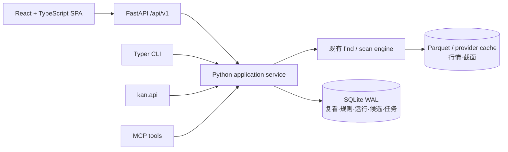

# vNext 选股工作台

> 当前实现 SOT。这里描述已经交付的板块趋势发现与 Screen 工作流；一次性 `kan find` 的兼容契约继续见 [`find.md`](find.md)。

用户明确要求日线同时收阳、收盘上涨及区间低点日期时，使用独立的
[`screen ohlc` 日线证据入口](ohlc-screen.md)。它返回一次查询事实，不改变已保存的 ScreenSpec 或候选状态。

## 1. 产品心智模型

慢慢看把趋势发现与选股拆成八个彼此独立的对象：

| 对象 | 解决的问题 | 关键性质 |
|---|---|---|
| `BoardTrendSnapshot` | 哪些行业/题材正在连续上涨、下跌、收阳或收阴？ | 一次只读截面；保留查询口径、来源、截止日、覆盖率和部分失败；不是股票结果行 |
| `BoardPulseSnapshot` | 选中板块在最新完整日有多少成员上涨、下跌或缺数？ | 同一今/昨截止日计算；不按指数权重，不声称新闻因果，不进入 ScreenRow |
| `BoardHistoryStudy` | 同一板块指数过去首次达到某个连续条件后怎样分布？ | 用户显式参数；只用板块原生指数历史；不拿当前成分股回填过去，不自动调参 |
| `BoardDailyReview` | 与上一份同口径行业/题材趋势相比，哪些事实发生变化？ | 不可变且 result-hash 幂等；区分延长、缩短、方向切换与数据可用性，不输出强弱评级 |
| `Screen` | 我定义了什么股票池、阈值、排序和字段？ | 保存时生成内容哈希；内容变化才追加版本；历史版本不可变 |
| `ScreenRun` | 这份规则在当时数据上得到什么结果？ | 每次运行不可变；固化规则、结果、覆盖率、证据、数据日和 diff |
| `CandidateList` | 哪些对象由我保留继续核对？ | 与 Screen 解耦；人工状态、备注和来源运行不会被重跑覆盖 |
| `CompareSet` | 哪几只股票需要放在同一口径下比较？ | 保存 3–10 个代码；只读取最近可追溯事实，不做综合评分 |

板块趋势回答“哪里正在形成连续走势”，成员 pulse 回答“板块内部最新交易日怎么动”，历史复核回答“同一指数过去的事件分布怎样”，每日复看回答“与上一份同口径事实相比发生了什么”；它们都不把连续延长写成转强，不把靠前成员写成指数贡献或事件因果。选中板块只会填入 Screen 的 `universe.kind/value`，不会自动生成条件。一次 Screen 命中也只是“符合用户写下的条件”，不是长期候选或买卖信号。

## 2. 架构与数据流



边界是刻意设计的：

- Python 是唯一的规则验证、数据访问、指标计算、排序、证据和持久化核心。
- React 只提交/展示生成自 OpenAPI 的类型，不重算金融事实。
- CLI 和 MCP 进程内调用 application service，不为了“前后端分离”额外依赖本机 HTTP daemon。
- 生产安装仍是一个 Python 包：wheel 自带已构建、带 hash 的 SPA；终端用户不需要 Node。
- 行情大表继续放 Parquet；需要事务、版本和关系查询的工作台状态放 SQLite。

## 3. ScreenSpec 契约

一份最小可运行规则：

```json
{
  "schema_version": 1,
  "name": "自选位置与估值核对",
  "universe": {"kind": "watchlist"},
  "as_of": {
    "trade_date": "latest_complete",
    "timezone": "Asia/Shanghai",
    "adjustment": "qfq",
    "freshness_policy": "allow_stale"
  },
  "match_mode": "all",
  "conditions": [
    {"type": "pos", "operator": "lt", "value": 30, "period": 180},
    {"type": "pe", "operator": "lt", "value": 35}
  ],
  "exclude_st": true,
  "exclude_star": false,
  "exclude_bj": false,
  "sort": [
    {"field_id": "position.180d", "direction": "asc", "nulls": "last"},
    {"field_id": "pe", "direction": "asc", "nulls": "last"}
  ],
  "columns": ["symbol", "name", "price", "position.180d", "pe"],
  "limit": 100
}
```

关键约束：

- 股票池支持 `watchlist`、`holdings`、`all`、`industry`、`theme`、`codes`；行业/题材需要 `value`，自定义代码池需要 `codes`。
- 最多 12 条条件、3 层排序和 10,000 条返回；未知字段、重复排序、重复结果列和入口多余字段都会被拒绝。
- 多条件默认 `all`，显式设置 `any` 才使用 OR。
- 条件缺值默认 `exclude`；设为 `fail` 时，候选池内存在该字段缺口就以 `incomplete_data` 失败。
- `freshness_policy=require_complete` 会拒绝带陈旧标记的数据；`allow_stale` 会运行并在 `warnings` 中保留提示。
- 当前执行只支持 `latest_complete`。历史事实通过不可变 `ScreenRun` 回看，不用今天的 provider 重造过去结果。
- 全市场使用截面路径，当前支持 23 类条件；逐股财务/股东类限制以 `kan screen filters` 和 `plan_screen` 的实时结果为准。

## 4. Web 主路径

运行 `kan web` 后默认进入 `/trends`：

1. 在趋势发现页选择行业/题材、收盘连续/阳线连续、方向、连续天数和排序，读取同一 `BoardTrendSnapshot`。
2. 选中板块后复核近日日涨跌轨迹和同一截止日的成员涨跌分布；停牌或缺行成员进入 `missing`，不当作平盘。
3. 点击“历史复核”会把当前板块、收盘/阳线口径、方向和连续天数显式带入；用户再设置未来窗口、历史范围和样本是否重叠，页面展示板块自身、沪深 300 与相对基准的分布及逐事件证据。
4. “每日复看”保存行业与题材趋势；第一份只建立基线，后续同口径记录显示连续天数和数据可用性变化。单类数据源失败只让该分区 partial，不会把全部板块写成退出。
5. 点击“用本板块选股”只把行业/题材及名称带入一个空 Screen。
6. 新建或打开 Screen，设置条件、排除项、缺失策略、排序和结果列。
7. “保存规则”只保存定义；“保存并运行”创建 SQLite 持久任务并生成不可变 ScreenRun。
8. 结果表展示用户选择的字段；右侧显示逐条件阈值、实际值、来源、数据日和 evidence ref。
9. 最近运行可切换查看；每日复看页也可顺序重跑全部已保存 Screen，继续记录 `added`、`removed` 和 `rank_changes`，不改变规则。
10. 结果可以进入独立候选池或 3–10 股对比组；“个股研究”与“市场与数据”页负责事实复核和持久行情刷新。

新建 Screen 是空规则：不预置阈值、排除项或排序，至少由用户添加一个条件或勾选一个排除项后才允许保存/运行。新增条件行会显示可编辑起始值，用户应在执行前明确核对字段、比较符和阈值。

旧 URL `/find`、`/stock/{symbol}`、`/hold` 由 SPA 映射到新页面；旧 `/api` 暂时作为兼容层保留，但不进入 OpenAPI，也不再拥有独立前端。

## 5. CLI

```bash
# 发现契约
kan screen filters
kan screen filters --format json

# 保存、更新和查看规则
kan screen save screen.json --format json
kan screen save screen.json --id <screen_id> --format json
kan screen list
kan screen show <screen_id> --format json
kan screen versions <screen_id> --format json
kan screen restore <screen_id> 1 --format json

# 运行和审计
kan screen run <screen_id> --format json
kan screen run-spec screen.json --no-persist --format json
kan screen runs <screen_id> --format json
kan screen show-run <run_id> --format json
```

`kan screen run`、Web 和 MCP 返回同一个 `ScreenRun` 模型。`run_id` 与运行时间每次不同；相同 canonical spec 和结果行的 `spec_hash`、`snapshot_id`、`result_hash` 稳定。

`kan find` 没有删除：它继续适合一次性 shell 查询和既有 JSON 消费者；需要保存、版本、diff、候选来源或 AI evidence handle 时使用 `kan screen`。

## 6. Python API

稳定入口统一从 `kan.api` 导入：

```python
from kan.api import (
    BoardKind,
    BoardDailyReviewRequest,
    BoardPulseQuery,
    BoardTrendQuery,
    ScreenSpec,
    get_run,
    create_board_review,
    query_board_pulse,
    query_board_trends,
    run_screen,
    save_screen,
)

boards = query_board_trends(BoardTrendQuery(kind=BoardKind.INDUSTRY, up=3))
for board in boards.rows:
    print(board.name, board.streak, board.latest_change_pct)

pulse = query_board_pulse(
    BoardPulseQuery(kind=BoardKind.INDUSTRY, value="电子", limit=5)
)
print(pulse.coverage.up, pulse.coverage.down, pulse.median_change_pct)

review = create_board_review(BoardDailyReviewRequest())
print(review.review_id, review.change_counts, review.partial)

spec = ScreenSpec.model_validate_json(open("screen.json", encoding="utf-8").read())
saved = save_screen(spec)
run = run_screen(
    saved.spec,
    screen_id=saved.screen_id,
    screen_version=saved.current_version,
)
same_run = get_run(run.run_id)
assert same_run.result_hash == run.result_hash
```

公开 surface 还包括板块趋势、成员结构、每日复看、板块指数历史复核的 typed 模型和 service，以及 Screen 列表、运行列表、候选增删、候选池列表、对比组、filter catalog、JSON Schema 和 `parse_screen_text / plan_screen / explain_run` typed AI adapter。内部 `kan.storage` 和 `kan.service` 路径不作为用户脚本 contract。

## 7. HTTP API 与 TypeScript

稳定 HTTP 前缀是 `/api/v1`，OpenAPI 位于 `/api/v1/openapi.json`。主要资源：

| 资源 | 路径 |
|---|---|
| 行业/题材趋势与成员结构 | `/boards/trends`、`/boards/{kind}/{value}/pulse` |
| 每日板块复看 | `/board-reviews`、`/board-reviews/{review_id}` |
| 板块指数历史复核 | `/board-history-studies` |
| Screen 与版本 | `/screens`、`/screens/{id}`、`/screens/{id}/versions`、`.../{version}/restore` |
| ScreenRun | `/screens/{id}/runs`、`/runs`、`/runs/{id}` |
| 候选池 | `/candidate-lists`、`/candidate-lists/{id}`、`.../candidates/{symbol}` |
| 对比组 | `/compare-sets`、`/compare-sets/{id}` |
| 持久任务 | `/jobs/screen-runs`、`/jobs/market-refresh`、`/jobs/{id}`、`/jobs/{id}/events` |
| 研究/市场/持仓/设置 | `/stocks/{symbol}`、`/market`、`/portfolio`、`/settings` |

所有业务请求/响应使用 Pydantic model；服务错误使用 `detail.code / message / hint`。浏览器写请求还必须通过本机会话、Host、Origin 和 `X-Kan-Web` 检查。

`webui/openapi.json` 和 `webui/src/api/schema.ts` 由后端 OpenAPI 生成：

```bash
npm --prefix webui run generate:api
npm --prefix webui run check
```

CI 会重新生成并检查 drift，防止 Python 与 TypeScript 各自维护一份手写契约。

## 8. MCP / AI 边界

| Tool | 作用 |
|---|---|
| `kan_screen_parse` | 只解析明确股票池、字段、比较符和数值；未知文字原样暴露，不猜阈值 |
| `kan_screen_plan` | 返回 canonical hash、执行路径、数据维度、来源、频率、限制和可执行性，不取数 |
| `kan_screen_run` | 用 ScreenSpec 或已保存 Screen 调同一 application service |
| `kan_screen_get` | 按 ID 取 Screen 或不可变 ScreenRun |
| `kan_screen_explain` | 只根据已保存 evidence 解释为什么命中、覆盖率和相邻运行变化 |

模型不获得任意 SQL、Pandas 或 provider 直连入口。像“低估”“强势”“近期”这类没有显式阈值的文字不会被静默编译成规则；调用方应展示 `ignored_text / assumptions / executable`，再由用户补充定义。

`kan_screen_parse.executable` 要求完整解析、无错误且引擎支持。草稿存在不等于可执行；部分表达中的连接词、排序和不支持的条件不得被删除后继续运行。

## 9. 运行证据与任务状态

`ScreenRun` 至少固化：

- 完整 `ScreenSpec`、Screen ID/版本、`spec_hash`。
- `snapshot_id`、`result_hash`、运行时间和耗时。
- `universe_size / evaluated / matched / returned / missing / ratio`。
- 数据截止日、陈旧标记和逐字段缺失计数。
- 每行 rank、结果值和逐条件 `evidence_ref / threshold / actual / source / data_date / formula_version`。
- 相对上一次同 Screen 运行的新增、移出和排名变化。

持久任务终态是 `succeeded / partial / failed / interrupted`。进程启动时，遗留的 `queued / running` 会转成 `interrupted`；市场刷新重新发起时会复用已经写入的行情缓存，而不是从零覆盖。

## 10. 当前边界

- 当前市场只实现 A 股；全市场刷新和多数截面条件需要用户自己的 TuShare 数据能力。
- 不接券商下单，不提供分钟级交易终端、多用户云服务或云同步。
- 不内置隐藏权重、综合评分、默认策略或模型生成的金融事实。
- `ScreenRun` 是运行时快照，不是完整 point-in-time 财报回测系统。
- `BoardDailyReview` 只保存 latest-complete 板块事实变化，不是当前成分股的历史收益回测。
- 工具只呈现用户规则命中和可追溯事实；历史数据不代表未来表现。
